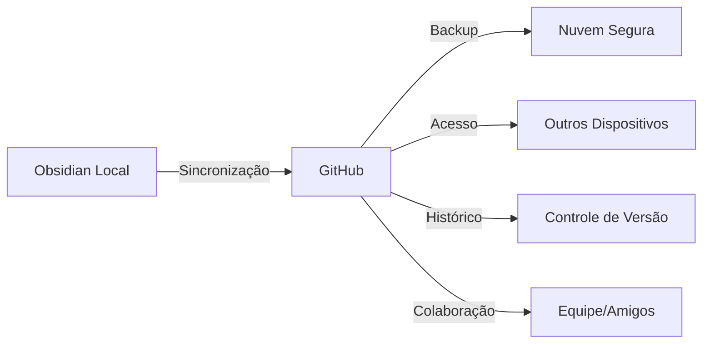

# Setup do Repositório GitHub para o E-book

## 🏷️ Configurações do Repositório

### Nome do Repositório
```
obsidian-github-guia-completo
```

### Descrição Curta (para o GitHub)
```
📚 Guia completo para integrar Obsidian com GitHub - Sincronize suas anotações de forma profissional com controle de versão e backup automático
```

### Topics/Tags (Separadas por vírgula)
```
obsidian, github, git, notas, sincronizacao, backup, controle-versao, tutorial, guia, portugues, brasil
```

---

# README.md Principal

```markdown
# 📚 Guia Completo: Integrando Obsidian com GitHub

<div align="center">


[](README.md)
[](https://creativecommons.org/licenses/by-sa/4.0/)
[](CONTRIBUTING.md)

**Sincronize suas anotações de forma profissional com controle de versão e backup automático**

[📖 Ler o Guia](#-o-que-você-vai-aprender) • [🚀 Começar Agora](#-como-usar-este-guia) • [❓ Dúvidas](#-suporte-e-comunidade) • [🤝 Contribuir](#-como-contribuir)

</div>

---

## 🎯 O que você vai aprender

Este guia ensina **passo a passo** como integrar o Obsidian com GitHub, permitindo que você:

- ✅ **Sincronize suas anotações** entre diferentes dispositivos
- ✅ **Mantenha um histórico completo** de todas as mudanças  
- ✅ **Faça backup automático** de seus arquivos
- ✅ **Colabore com outras pessoas** em projetos de conhecimento
- ✅ **Acesse suas notas** de qualquer lugar do mundo
- ✅ **Use ferramentas profissionais** de forma gratuita

## 🚀 Como usar este guia

### 📋 Pré-requisitos
- Conhecimento básico de computador
- Aproximadamente **30 minutos** para configuração
- Acesso à internet
- Conta de email válida

### 📚 Conteúdo do Guia

| Seção | Descrição | Tempo |
|-------|-----------|-------|
| 🎯 [Introdução](ebook.md#introdução) | Por que usar Obsidian + GitHub | 5 min |
| 📥 [Instalação](ebook.md#instalação-das-ferramentas) | Obsidian, Git e conta GitHub | 10 min |
| 🔧 [Configuração](ebook.md#configuração-inicial) | Setup inicial das ferramentas | 10 min |
| 🔌 [Plugin Git](ebook.md#configuração-do-plugin-git) | Instalação e configuração | 5 min |
| 🔐 [Autenticação](ebook.md#configuração-da-autenticação) | Personal Access Token | 5 min |
| 🔗 [Conexão](ebook.md#conectando-obsidian-ao-github) | Ligando tudo | 10 min |
| 🚀 [Primeiros Passos](ebook.md#primeiros-passos-práticos) | Testando a integração | 5 min |
| 🛠️ [Solução de Problemas](ebook.md#solução-de-problemas-comuns) | Troubleshooting | Conforme necessário |

### 📖 Começar a Leitura

👉 **[CLIQUE AQUI PARA ACESSAR O E-BOOK COMPLETO](ebook.md)**

## 🌟 Por que este guia é diferente?

- **✨ Atualizado 2025**: Inclui autenticação por token (crítico!)
- **🔧 Tecnicamente correto**: Comandos testados e sequência correta
- **📱 Multi-plataforma**: Windows, macOS e Linux
- **🇧🇷 Em português**: Linguagem clara e acessível
- **🛠️ Troubleshooting**: Soluções para problemas comuns
- **🆓 Completamente gratuito**: Sem pegadinhas ou vendas

## 🎯 Para quem é este guia?

### ✅ Ideal para você se:
- Usa ou quer usar o Obsidian
- Precisa sincronizar notas entre dispositivos
- Quer backup automático e seguro
- Busca solução gratuita e profissional
- Quer aprender Git de forma prática

### ❌ Talvez não seja para você se:
- Só usa um dispositivo (celular)
- Não tem acesso à internet regularmente
- Prefere soluções completamente visuais (sem terminal)

## 📊 Resultados após seguir o guia



## 🛡️ Segurança e Privacidade

- 🔒 **Repositórios privados gratuitos** no GitHub
- 🔐 **Autenticação por token** (mais segura que senhas)
- 📱 **Controle total** sobre seus dados
- 🚫 **Sem dependência** de serviços pagos
- ✅ **Padrão da indústria** usado por milhões

## 🗂️ Estrutura do Repositório

```
📁 obsidian-github-guia-completo/
├── 📄 README.md                 # Este arquivo
├── 📚 ebook.md                  # E-book completo
├── 🖼️ imagens/                  # Capturas de tela (futuro)
├── 📋 CONTRIBUTING.md           # Como contribuir
├── ⚖️ LICENSE                   # Licença CC BY-SA 4.0
└── 🔧 scripts/                  # Scripts auxiliares (futuro)
```

## 🤝 Como contribuir

Sua contribuição é muito bem-vinda! Você pode:

- 🐛 **Reportar bugs** ou informações desatualizadas
- 💡 **Sugerir melhorias** no conteúdo
- 📝 **Corrigir erros** de digitação ou gramática  
- 🖼️ **Adicionar capturas de tela** para ilustrar
- 🌍 **Traduzir** para outros idiomas
- ⭐ **Dar uma estrela** no repositório

### 🚀 Como contribuir rapidamente

1. **Fork** este repositório
2. **Edite** o arquivo que quer melhorar
3. **Envie um Pull Request** com descrição clara
4. **Aguarde** a revisão e merge

Veja detalhes em [CONTRIBUTING.md](CONTRIBUTING.md)

## 📞 Suporte e Comunidade

### 💬 Tem dúvidas?

- 📋 **Issues do GitHub**: [Abrir nova issue](../../issues)
- 💬 **Discussions**: [Participar das discussões](../../discussions)
- 📧 **Email**: [seu.email@exemplo.com](mailto:seu.email@exemplo.com)

### 🌐 Comunidades relacionadas

- 🗨️ **[Fórum Obsidian](https://forum.obsidian.md/)** - Comunidade oficial Obsidian
- 💬 **[Discord Obsidian](https://discord.gg/obsidianmd)** - Chat em tempo real
- 🇧🇷 **[Obsidian Brasil](https://t.me/obsidianbrasil)** - Telegram brasileiro

## 📈 Estatísticas


## 🏆 Agradecimentos

- **Obsidian Team** - Por criar uma ferramenta incrível
- **Vinzent** - Desenvolvedor do plugin Obsidian Git
- **GitHub** - Por oferecer repositórios privados gratuitos
- **Comunidade** - Por feedback e contribuições

## ⚖️ Licença

Este trabalho está licenciado sob [Creative Commons Attribution-ShareAlike 4.0 International License](https://creativecommons.org/licenses/by-sa/4.0/).

**Isso significa que você pode**:
- ✅ Compartilhar o material
- ✅ Adaptar e modificar
- ✅ Usar comercialmente

**Desde que você**:
- 📝 Dê crédito adequado
- 🔗 Indique se mudanças foram feitas
- 📄 Use a mesma licença

## 📋 Changelog

### v2.0 (Junho 2025)
- ✨ Reescrita completa do guia original
- 🔐 Adicionada seção de autenticação por token
- 🛠️ Seção completa de troubleshooting
- 🖥️ Comandos para todas as plataformas
- 📝 Correções gramaticais e técnicas

### v1.0 (Versão Original)
- 📚 Primeira versão do e-book

---

<div align="center">

**⭐ Se este guia foi útil, considere dar uma estrela no repositório!**

**📢 Compartilhe com amigos que usam Obsidian!**

[](https://github.com/seuusuario)
[](https://twitter.com/seuusuario)
[](https://linkedin.com/in/seuusuario)

*Feito com ❤️ para a comunidade brasileira de Obsidian*

</div>
```

---

## 📝 CONTRIBUTING.md

```markdown
# Como Contribuir

Obrigado pelo interesse em contribuir com este projeto! 🎉

## 🚀 Formas de Contribuir

### 🐛 Reportando Bugs
- Use o template de issue para bugs
- Inclua informações do sistema (OS, versão do Obsidian, etc.)
- Descreva passos para reproduzir o problema

### 💡 Sugerindo Melhorias
- Use o template de feature request
- Explique o problema que a melhoria resolve
- Forneça exemplos de uso

### 📝 Melhorando a Documentação
- Correções de gramática/ortografia
- Adição de exemplos
- Capturas de tela
- Esclarecimentos técnicos

## 📋 Processo de Contribuição

1. Fork o repositório
2. Crie uma branch: `git checkout -b minha-contribuicao`
3. Faça suas mudanças
4. Teste as instruções (se aplicável)
5. Commit: `git commit -m "Descrição clara da mudança"`
6. Push: `git push origin minha-contribuicao`
7. Abra um Pull Request

## ✅ Checklist antes do PR

- [ ] Testei as instruções em meu sistema
- [ ] Corrigi erros de português
- [ ] Adicionei exemplos quando necessário
- [ ] Mantive o tom acessível e didático
- [ ] Atualizei o índice se necessário

## 🎯 Estilo de Escrita

- **Tom**: Didático e acessível
- **Público**: Iniciantes em Git/GitHub
- **Formato**: Markdown com emojis
- **Idioma**: Português brasileiro
- **Exemplos**: Sempre que possível

Obrigado por contribuir! 🙏
```

---

## ⚙️ Configurações Adicionais do Repositório

### Issues Templates

Crie pasta `.github/ISSUE_TEMPLATE/`:

**bug_report.md**:
```yaml
---
name: Bug Report
about: Reportar um erro no guia
title: '[BUG] '
labels: bug
assignees: ''
---

**Descreva o bug**
Descrição clara do problema.

**Para reproduzir**
Passos para reproduzir:
1. 
2. 
3. 

**Sistema**
- OS: [Windows/Mac/Linux]
- Versão do Obsidian:
- Versão do Git:

**Screenshots**
Se aplicável, adicione capturas de tela.
```

### GitHub Actions (Futuro)

Para automatizar verificações de links, ortografia, etc.

---

Esta estrutura profissional vai fazer seu e-book se destacar no GitHub! Quer que eu ajuste alguma seção ou adicione mais alguma funcionalidade?